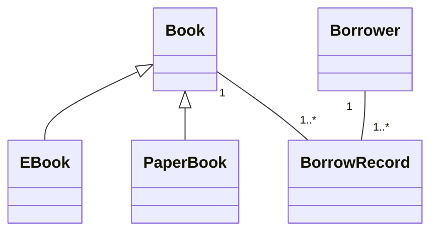

# 📚 Java Library Management System
**Developer**: Bachir SOUFIA (bachirsf4@gmail.com) ,group :2
📧 bachirsf4@gmail.com


## ✨ Distinct Features
- **Advanced Book Catalog** (Paper/eBooks)
- **Borrower Analytics**
- **Loan History Tracking**
- **Custom Search Algorithms**

```bash
# Clone & Run
git clone https://github.com/bachirsf4/java-library-oop-system.git
cd java-library-oop-system
javac -d out src/**/*.java src/*.java
java -cp out Main
```

## 🏛️ Architecture

## 📂 Project Structure
```bash
.
├── src/
│   ├── models/       # Book, Borrower classes
│   ├── services/     # Business logic
│   └── utils/        # Helpers
└── README.md
```
### Program Menu Guide
| Option | Action                          | Example Usage                  |
|--------|---------------------------------|--------------------------------|
| 1      | Add new book                    | Enter title, author, ISBN      |
| 2      | Add new borrower                | Student ID, name               |
| 3      | Borrow a book                   | Book ISBN + borrower ID        |
| 4      | Return a book                   | Book ISBN to return            |
| 5      | Search books                    | By title/author/ISBN           |
| 6      | View all books                  | Shows complete catalog         |
| 7      | View all borrowers              | Lists registered users         |
| 8      | View borrowing history          | Shows all loans                |


