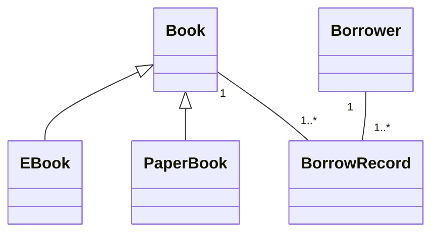

# 📚 Java Library Management System
**By Bachir SOUFiA**  
📧 bachirsf4@gmail.com


## ✨ Distinct Features
- **Advanced Book Catalog** (Paper/eBooks)
- **Borrower Analytics**
- **Loan History Tracking**
- **Custom Search Algorithms**

```bash
# Clone & Run
git clone https://github.com/bachirsf4/java-library-oop-system.git
cd java-library-oop-system
javac -d out src/**/*.java src/*.java
java -cp out Main
```

## 🏛️ Architecture

## 📂 Project Structure
```bash
.
├── src/
│   ├── models/       # Book, Borrower classes
│   ├── services/     # Business logic
│   └── utils/        # Helpers
└── README.md
```

